# transformWaveletHaarImage
Здесь планируется к разработке программа, которая будет выполнять вейвлет преобразования Хаара к изображению NxN, где N = 2i

Ссылки на статьи (вдохновители): 

[Первая](http://problem-info.sscc.ru/2011-2/2.pdf)

[Вторая](https://www.idosi.org/wasj/wasj7%285%29/13.pdf)

Ссылка на мою статью:
[Статья, как результат работы](https://disk.yandex.ru/i/qPEF-GYeRsy4QQ)

На первом этапе было написан алгоритм линейного преобразования прямого и обратного, а также их двумерных представлений. 

Программа была написанна на c#. Она расположенна в ветке _master_

Но дальнейшая реализация планируется на c++ qt.

<b> Вывод программы. </b>

Исходная матрица

| 1 | 2 | 3 | 4 |
|---|---|---|---|
| 4 | 3 | 7 | 8 |
| 6 | 2 | 1 | 8 |
| 2 | 5 | 4 | 7 |

Применение прямого вейвлет преобразования Хаара к строкам

| 2.12 | 4.95 | -0.71 | -0.71 |
|------|------|-------|-------|
| 4.95 | 10.61| 0.71  | -0.71 |
| 5.66 | 6.36 | 2.83  | -4.95 |
| 4.95 | 7.78 | -2.12 | -2.12 |

Применение прямого вейвлет преобразования Хаара к строкам и столбцам

| 5    | 11   | 0    | -1   |
|------|------|------|------|
| 7.5  | 10   | 0.5  | -5   |
| -2   | -4   | -1   | 0    |
| 0.5  | -1   | 3.5  | -2   |

Применение обратного вейвлет преобразования Хаара к столбцам преобразованной матрицы

| 2.12 | 4.95 | -0.71 | -0.71 |
|------|------|-------|-------|
| 4.95 | 10.61| 0.71  | -0.71 |
| 5.66 | 6.36 | 2.83  | -4.95 |
| 4.95 | 7.78 | -2.12 | -2.12 |

Применение обратного вейвлет преобразования Хаара к столбцам и строкам преобразованной матрицы

| 1 | 2 | 3 | 4 |
|---|---|---|---|
| 4 | 3 | 7 | 8 |
| 6 | 2 | 1 | 8 |
| 2 | 5 | 4 | 7 |

<b> 12.04.24 </b>

Примеры работы итоговой программы: 
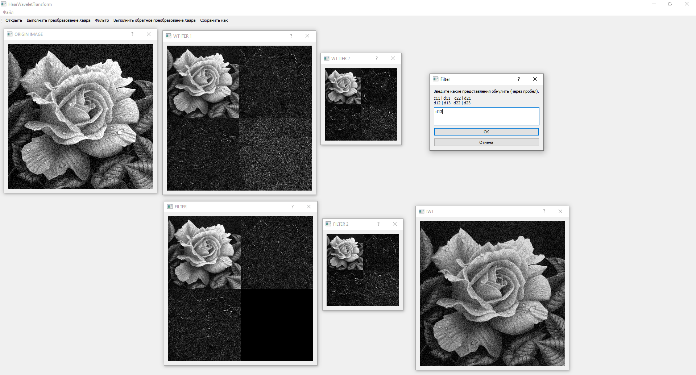
Пример 1
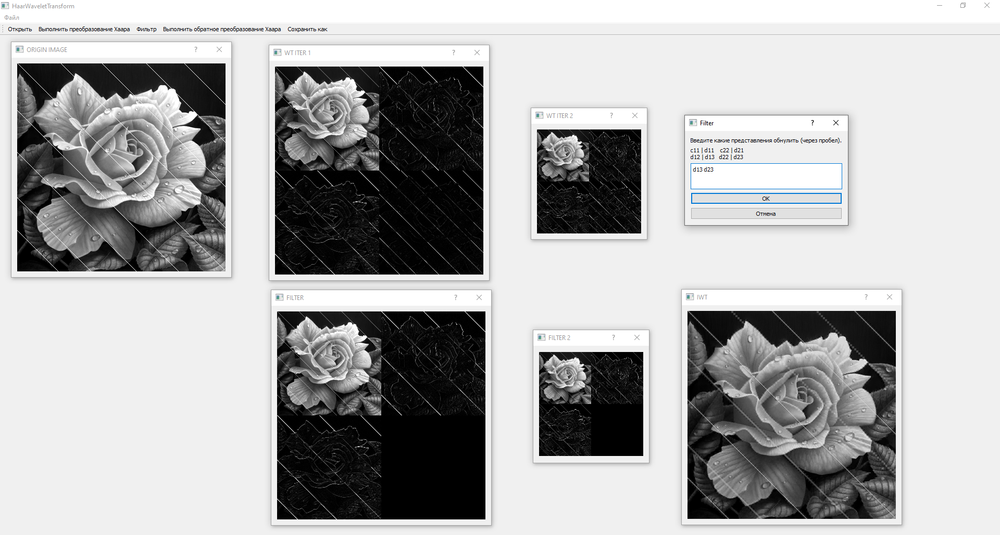
Пример 2
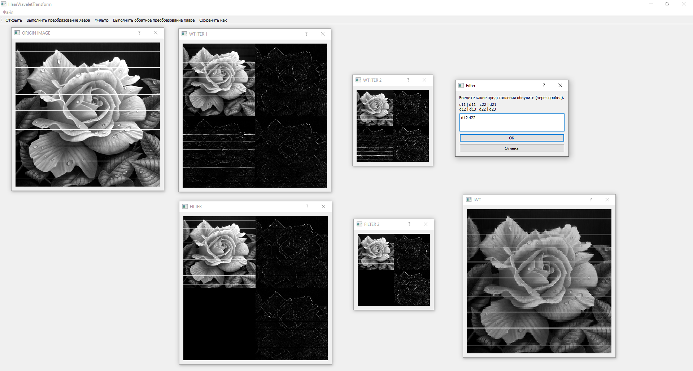
Пример 3
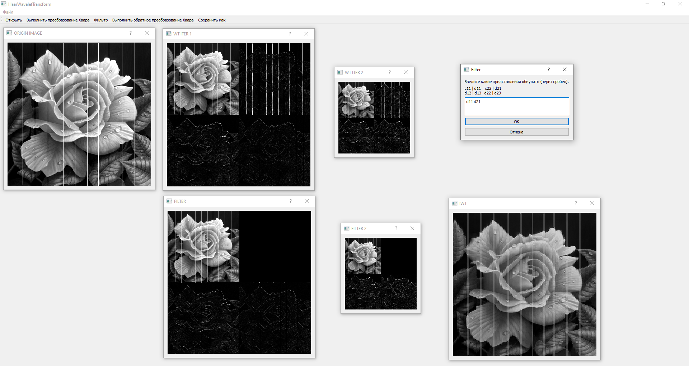
Пример 4

<b> 25.04.24 </b>

Добавлена возможность генерировать шумы из вертикальных и горизонтальных линий напрямую в программе. Интенсивность линий выбирается случайно из заданного диапозона. 
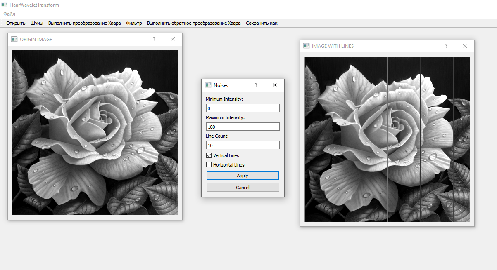
Пример 5
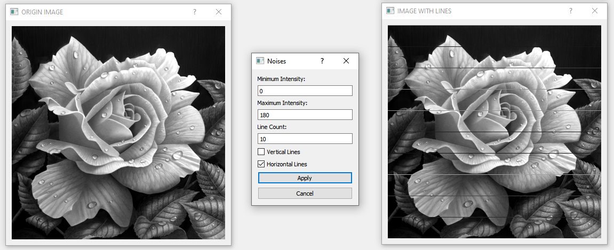
Пример 6

Теперь для вейвлет преобразования используется разложения на 4 уровня.
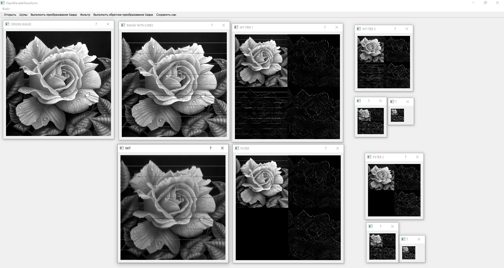
Пример 7

<b> 02.05.24 </b>

Добавление функционала. После каждой итерации в онке спрашивается, какой следущий квадрант выбрать для вейвлет преобразования. 
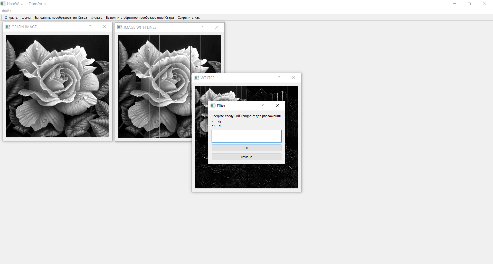
Пример 8.1
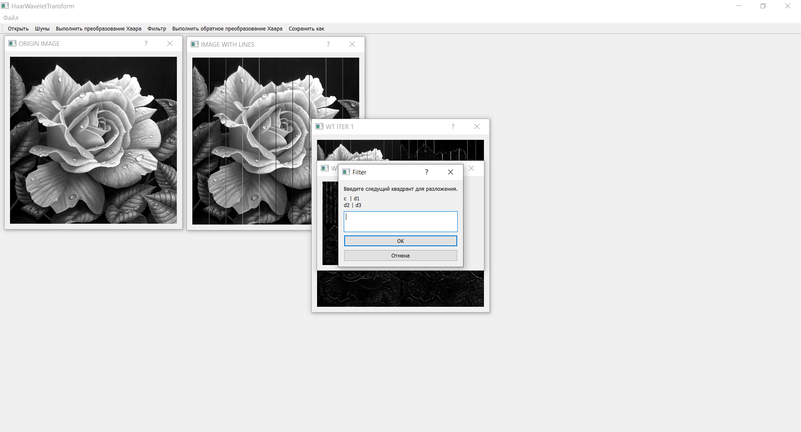
Пример 8.2
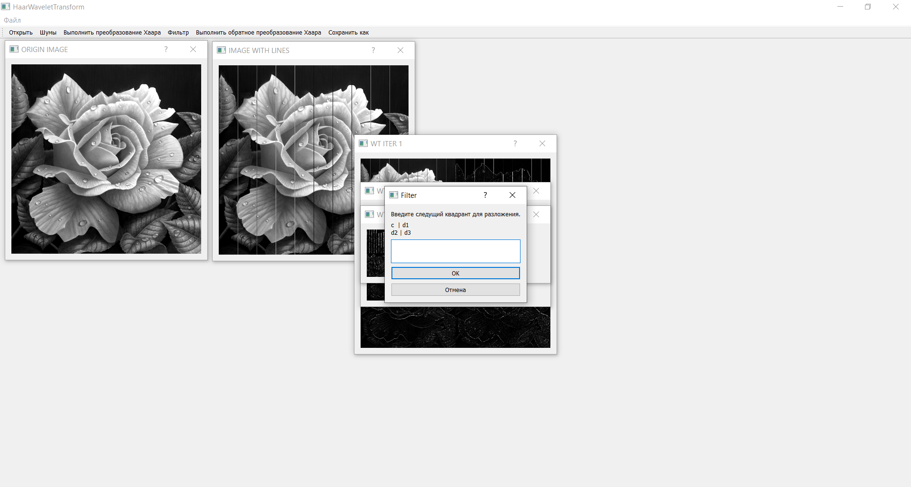
Пример 8.3
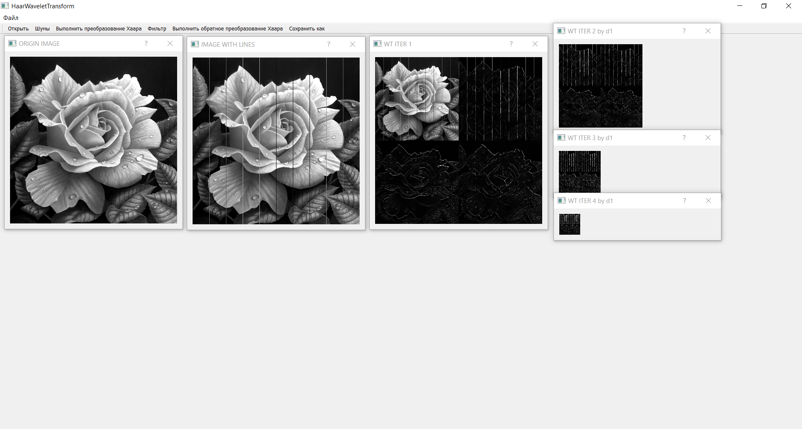
Пример 8.4
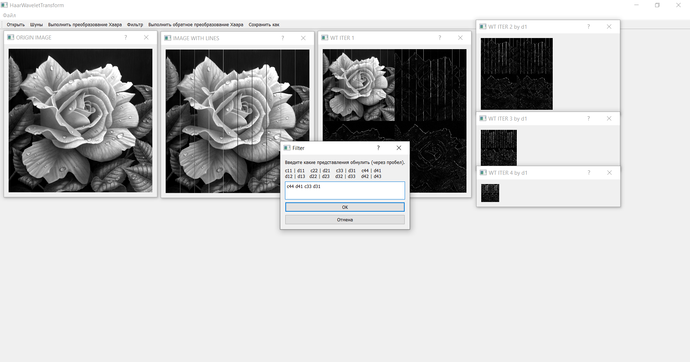
Пример 8.5
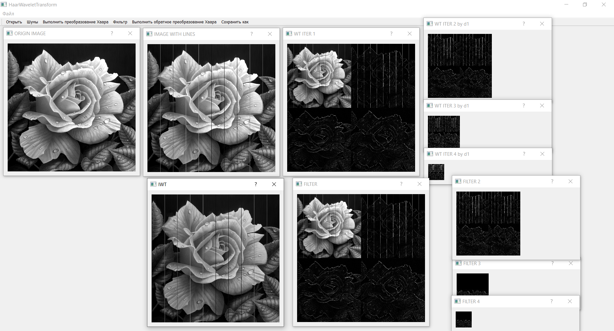
Пример 8.6

<b> 06.05.24 </b>
